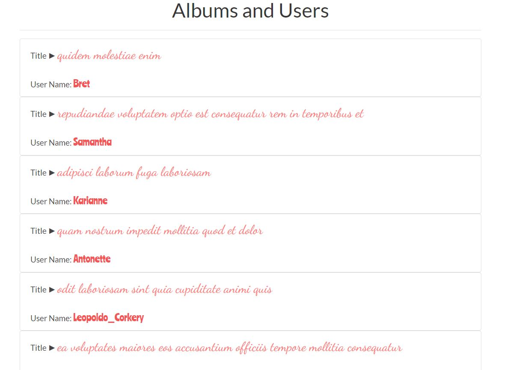

# vue.js_photogallery_project

## Vue.js vue-resource usage with http://jsonplaceholder.typicode.com/

### API used-
1. http://jsonplaceholder.typicode.com/albums
2. https://jsonplaceholder.typicode.com/photos
3. http://jsonplaceholder.typicode.com/users


## Build Setup

``` bash
# install dependencies
npm install

# serve with hot reload at localhost:8080
npm run dev

# build for production with minification
npm run build
```


